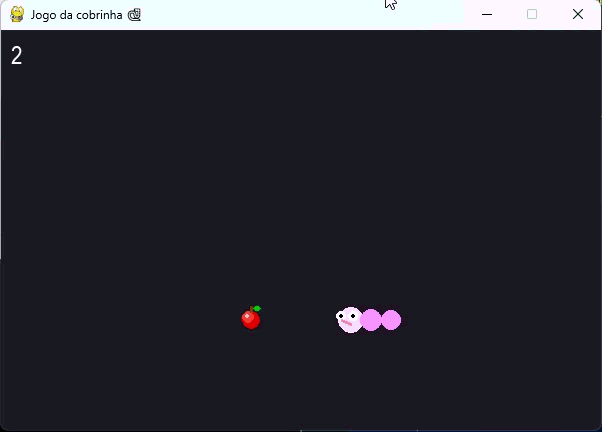

# 🐍 PySnake: Animated Edition
O clássico jogo da cobrinha com movimentação fluida e skins personalizáveis.

## 📝 Descrição
- Uma implementação moderna do Snake Game focada em estética e experiência de usuário. O projeto utiliza matemática para criar animações mais orgânicas, distanciando-se das versões rígidas e estáticas do passado.

## 🧐 Sobre o Jogo
- Desenvolvido inteiramente com Pygame, o jogo destaca-se pelos detalhes visuais:
- Animação Senoidal: O corpo da cobra possui um efeito de pulsação e ondulação suave.
- Rosto Dinâmico: Olhos que acompanham a direção e uma língua animada que reage ao tempo.
- Customização: Menu inicial interativo com suporte a nomes personalizados e seleção de 5 skins exclusivas.

## 🎓 Objetivo Educacional
Este projeto foi um laboratório prático para consolidar conceitos de:

- Matemática para Games: Aplicação de funções trigonométricas para animação de sprites.
- Lógica de Matrizes: Gerenciamento das coordenadas do corpo e detecção de colisões.
- UI/UX em Pygame: Criação de botões com efeito de hover (escala) e campos de entrada de texto.
- Game Loop: Controle preciso de FPS e atualização de estados (Menu > Jogo > Game Over).

## 🛠️ Tecnologias Utilizadas
- Python 3: Núcleo do processamento.
- Pygame: Engine gráfica e gerenciamento de eventos.
- Math: Para os cálculos de ondulação e cores dinâmicas.

## 🎮 Demonstração

  

## 🚀 Funcionalidades
- 5 Skins Disponíveis: Seleção visual com preview animado.
- Dificuldade Progressiva: A velocidade aumenta conforme você pontua, desafiando seus reflexos.
- Design de Itens: Comida estilizada com brilho e detalhes gráficos.
- Sistema de Game Over: Tela de resultados exibindo o nome do jogador e a pontuação final.
